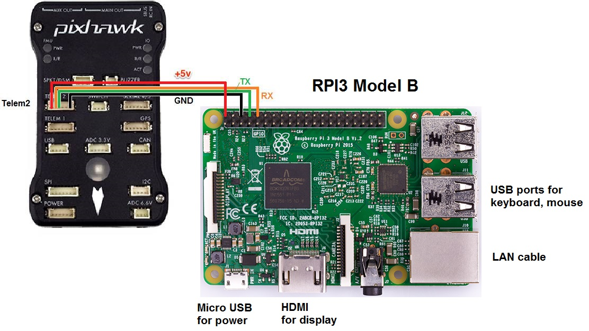

# dronekit測試程式

## 使用Mavlink協議令raspberry pi4和mini pixhawk4連接
前置作業：在Raspberry Pi 4安裝好Raspbian OS
+ 1.打開終端機，依序輸入下列指令
    ```py
    1.sudo apt-get update
    ```
    ```py
    2.sudo apt-get install screen python-wxgtk3.0 python-matplotlib python-opencv python-pip python-numpy python-dev libxml2-dev libxslt-dev
    ```
    ```py
    3.sudo pip install future
    ```
    ```py
    4.sudo pip install pymavlink
    ```
    ```py
    5.sudo pip install mavproxy
    ``` 
+ 2.連接Raspberry Pi 4和mini Pixhawk4
    
    ```diff
    - 注意! 當Raspberry Pi 4是額外接穩定的5V電源時，千萬不要再接上圖的紅線，會燒掉
    ```
+ 3.設定Pixhawk
    + 1.電腦開啟Mission Planner，透過USB to Micro USB接上mini Pixhawk4
    + 2.選擇COM?，然後以115200連接
    + 3.等載入完設定，選擇上方的"配置/測試"，點選左側的"Full Parameter List"
    + 4.找到SERIAL?_BAUD這個參數(此參數為serial?的參數)，雙擊數值欄位，改成57(代表57600)
    + 5.找到SERIAL?_PROTOCOL，值改成1，儲存
+ 4.開始測試
    + 測試前需要先禁用raspberry pi的藍芽 
    ```py
    nano /boot/config.txt
    dtoverlay=disable-bt#添加在最後兩行
    ```
    + 測試指令
    ```py
    mavproxy.py --master=/dev/ttyAMA0 --baudrate 57600 --aircraft MyCopter
    ```
## 使用自己的python腳本運行
+ 在樹梅派上安裝Dronekit(原本使用apt-get來安裝，但發現執行腳本的時候會找不到dronekit的module，後來改採直接從github上clone下來安裝)
```py
1.git clone https://github.com/dronekit/dronekit-python.git
```
```py
2.cd ./dronekit-python
```
```py
3.sudo python setup.py build
```
```py
4.sudo python setup.py install
```
+ 在和dronekit-python相同目錄底下寫python腳本
+ 以mavlink通訊協議測試腳本運行
```py
python 腳本名.py --connect "/dev/ttyAMA0"
```

## 參考資料
網址:
+ https://rmotex.blogspot.com/2017/10/raspberry-pi-3-pixhawk-mavlinkmacos.html
+ https://rmotex.blogspot.com/2017/10/raspberry-pi-3-pixhawk-dronekitpython.html
